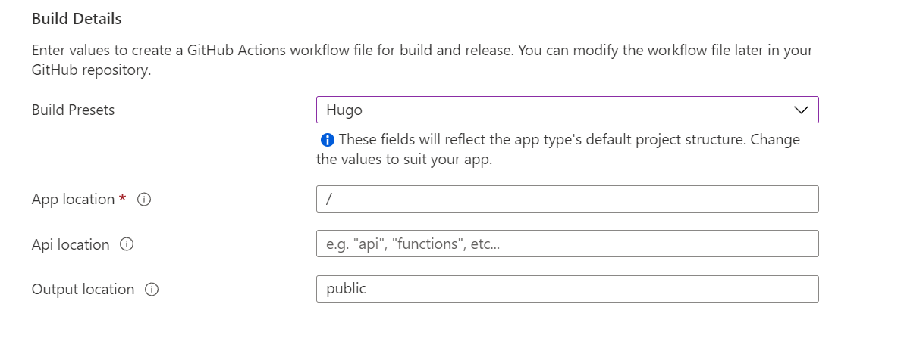

## Publishing your Hugo Blog to Azure

### What did we do in part one? 

In part one, I shown how to install the Hugo CLI on Windows and how to set up a new Hugo Blog locally on your PC. By using Visual Studio Code, this allowed us to create our new blog and start creating content in Markdown.


In part two of this small guide, I will show how to upload your new blog to Azure in the form of Azure Static Web Apps through uploading your Blog to GitHub and how to set up your Azure Static Web App in the Azure portal.

## Uploading your Hugo Blog to Github

A key part to Azure Static Web Apps, is Github. SWA's connect to Github through a Github action, so when you upload new content to your blog or amend a part of your website, A Github action will run and upload that content to your site in Azure.

Firstly, we will need to upload your local hugo blog to a Github repository. The Github Repository can be either a public or private repository. Its probably good advice to keep your blog/content repository private though.

Once your Github Repo has been created, you will need to push your Hugo blog code to the Repo. To do this you will need to follow the Git commands shown in Github when you create your Repository. (this will need Git  installed on your machine)


Once uploaded you should see your files and folders from your local hugo site, uploaded into your Github repository. From here we can now proceed with setting up the Azure Static Web App.

## Creating an Azure Static Web App in the Azure portal

If you haven't got an Azure Subscription, you will need to get one before you can carry on with setting up your Static Web App, Start for free here: [Azure Sign up](https://azure.microsoft.com/en-gb/free/). If you have got an Azure Subscription, please sign into the Azure Portal to get started, and search for "Static Web Apps" in the azure portal:


Once you have select the Azure Static Web Apps option, continue with creating your Azure Static Web App. It will need a Resource Group creating before the SWA can be created. As you can see from the screenshot below, there is a free tier of Azure Static Web Apps, This currently offers nearly everything that SWAs offer, including the likes of SSL certificates.




The major part of the SWA creation is the connection to your Github repository. You will need to sign into Github from the Azure Portal and give Azure permission to connect to Github. 


Once you are connected to Github in the Azure portal, you can select the repository that contains your Hugo blog. Once you have selected your repository, there are numerous options available to show Azure how your content is stored in Github. These are done through build presets. There are numerous options for React, Angular and the one we will be using Hugo. 



If you select the Hugo build preset, it is recommended you keep the default values shown. If you have an API you can locate where the API is stored inside of your Github repository.

Once you have completed this, you can then add tags if you use them. Once you are ready to go you can hit the create button to start the process of creating your Azure Static Web App. As you can see from the portal screenshot below, your Static Web App will be given a randomly generated URL:


Thankfully a function within Azure Static Web Apps is that we can use custom domains so that we dont need to use the randomly generated web URL once we are happy with our new Blog. 

## Github Actions and the creation of the Hugo Blog on Azure

Upon the creation of the Static Web App in Azure, Azure will then create a Github Action in your Github repository. this Github action will run initially and when any content is updated or uploaded in your Github repository, this allows for your Blog to be kept up to date with any content you produce.

Whilst your initial Github is running, your Static Web App will be waiting for your content, as seen below:


Whilst this is displayed, the Github Action will continue to run in the background on Github. 

If you visit your Github Repository on Github, you can see there is an option to look at the current Github Actions running on your repository. There will be an initial action running when you deploy the Static Web App in Azure, This shows the action running through your code and then deploying it in Azure. You will see similarities with building your Hugo Blog locally:




Upon completion of the Github action, your Hugo website should be deployed to your Azure Static Web App! The github action upon completion will show that it is successfully ran and provides a link to your Static Web App:


## What is Orix?

[Orix](https://github.com/microsoft/Oryx) is the build tool you will see being used in the Github action to deploy your Hugo blog into Azure. Oryx is a build system which automatically compiles source code repos into runnable artifacts. It is used to build web apps for Azure App Service and other platforms such as Static Web Apps. You can find out more information about Oryx in the link to the Github Repository above.

## Github Actions File

Upon the deployment of your Azure Static Web App, there is a Github folder created in the repository and a work flow file. This work flow file shows where your application is deployed upon some other things needed for your Github repository to connect to Azure. A major part of the work flow file is the three sections shown below, which are too locate your site, its API location and output location, these represent what you created originally in the Azure portal:

```yaml
         ###### Repository/Build Configurations - These values can be configured to match your app requirements. ######
          # For more information regarding Static Web App workflow configurations, please visit: https://aka.ms/swaworkflowconfig
          app_location: "/" # App source code path
          api_location: "" # Api source code path - optional
          output_location: "public" # Built app content directory - optional
          ###### End of Repository/Build Configurations ######
```

If you ever run into issues with deploying your website, this may be where it was misconfigured, if you go into this YAML file, you can amend the App location and try deploying your hugo blog again.

## Summary

Overall Azure Static Web Apps are a great way to get into deploying a modern website like a Hugo Blog as well as learn some CI/CD at the same time with the use of Github Actions. Having a free tier with Static Web Apps provides a great solution for all us wannabe bloggers with a platform for hosting great content in a way that is fast and secure. 

Static Web Apps have gave myself the encouragement to go out and start writin blog posts and to also learn about Github, Github Actions and how to deploy a modern web application. They provide a great solution to build out serverless applications at a free or minimal cost. 

It has took some time for myself to get used to writing content in a Markdown format, but with the use of Visual Studio Code, it has helped me greatly with getting used to shortcodes in Markdown. I also gave Ghostwriter a go as a standalone markdown writer, which was great, but with Markdown extensions in the Visual Studio Code marketplace, I didn't think VS Code would be beaten when writing in this format. 

So what's next? I hope to learn a bit of Terraform along the way with deploying SWA's as there is now a Terraform module for deploying Static Web Apps, so I will give that a try at some point, and hopefully do a part three to deploying Static Web Apps.

I hope you found this walk through easy to follow and hopefully gave a learning path into how I deployed this blog with the use of Static Web apps. 
