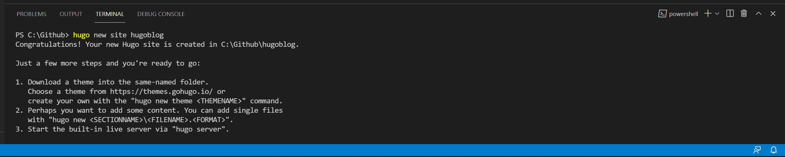
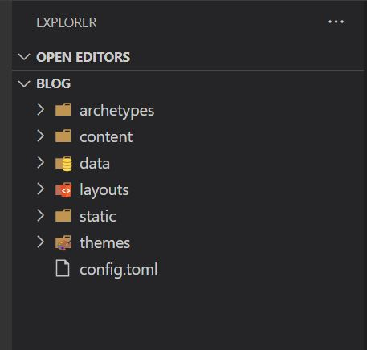
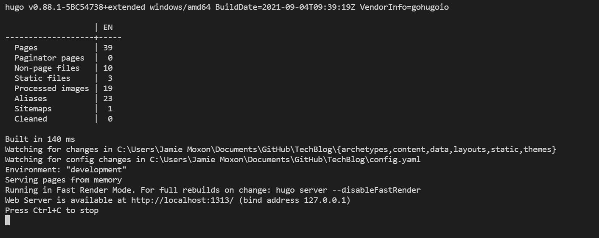

## Overview

Azure static Web Apps (SWAs) are a great way to get up and running with your own blog or website.
I have always been a big advocate of WordPress in the past to get up and running with a relatively
modern blog, but often WordPress can be quite cumbersome and often slow for a basic blog.

Fast forward to 2021, and SWA's are a great solution for hosting web applications such as Hugo blogs or React applications.
They are a Serverless resource in Azure that allows us to use some nice CI/CD technology in deploying our web apps to Azure.
One of the best things about SWA's is that there is a free tier which gives us a lot of room to work with and gives us niceties such as free SSL certificates.

# What is Hugo?



[Hugo](https://gohugo.io/) is a popular static website generator. With using Hugo, we don't need to really care for any code or database in the back end.
Instead of this, the HTML pages are generated each time your content is created or updated. Instead of writing content in an online content management system such as WordPress or even directly into HTML pages, Hugo uses Markdown, and then once you are happy with your new content, this is then pushed to the Hugo site and generated in HTML.

Themes are a big part of Hugo, there is a [nice theme gallery](https://themes.gohugo.io/) on the Hugo website which you can download themes from and apply them to your own website. Download a theme and put it in your '\themes' folder and then change your configuration file to apply the new theme.

With Static sites, there is no run time needed to run the website, therefore this opens up a huge array of hosting, such as Azure Static Web Apps. 

# Setting up your local Hugo Environment

Before we get started in setting up your Static Web App in Azure and Github, Hugo can be set up locally on your machine before we go live into Azure and onto the web.

## Installing Hugo on Windows

I am an avid user of the Package manager Chocolatey, and thankfully Hugo is available through the chocolatey package manager. If you haven't got Chocolatey installed on your Windows machine, I highly recommend taking a look: [chocolatey.org](https://chocolatey.org/install)

If you have got Chocolatey installed, you can run this command in an elevated Powershell to install Hugo:

`choco install hugo -y`

A reboot may be needed after Hugo has been installed.

## Creating your local folder structure

Once Hugo has been installed, you can now begin to create the base of your new Hugo blog. To start, create a folder in where you either store your GitHub repositories, or simply just create a new folder, this is where your Hugo blog will be stored and eventually uploaded to GitHub.

If you have got Visual Studio Code installed, open a PowerShell terminal and run the following command to create the base of your hugo blog:

`hugo new site hugoblog`

This will create a blog named "hugoblog". Please note that to create a blog with the same name as the folder you created above, navigate to the directory above where your new folder is, and name the blog with the same name as the folder, this ensures that the folder will be the root of the new blog.

This command will create numerous folders and files inside of your blog folder, this is where you will store your content of your site.

## Downloading and installing a theme

Themes are going to be a big part of your new Hugo site, thankfully these can be downloaded for free from numerous sites. Once you have downloaded a theme, extract the themes files into your Themes folder. with any good Hugo theme, they will come with some basic instructions on how to get your website up and running. For example the theme I use on this website came with an example website and how to customise the .YAML file with your specifications. 

## Building your Hugo website locally

With Hugo installed locally, you can run a build of your website locally on your machine and visit it through the web browser, this helps with testing your website before uploading it to Github and eventually onto Azure. 

To build your Hugo website locally, navigate to the root of your Hugo folder in a terminal, and run the following command

`Hugo Serve`

This will build your Hugo website if successful, which you can then visit at: http://localhost:1313

# What's coming in part Two

In part two of this series about how to create a Hugo based blog on Azure, we will run through numerous steps on how to get your new blog live and on the web:

1. How to upload your new Hugo blog to GitHub
2. How to create your Static Web App in the Azure Portal
3. How to connect your Static Web App to your Blog GitHub Repository
4. Updating your Blog & GitHub Actions