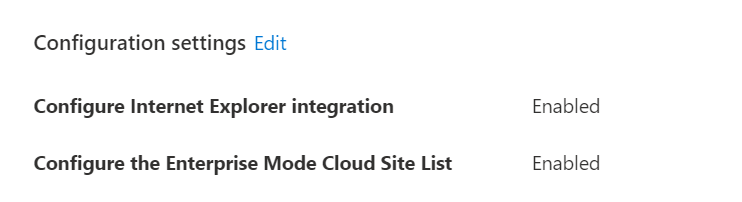

At Microsoft Ignite 2021, The Edge team announced the capability to create an Enterprise Website list for Edge directly in the M365 admin centre.(Cloud Site List Management) Previously this was done on premise with an XML file and a tool called Enterprise site list manager.

Now with Microsoft 365, this can all be done in the cloud through the Microsoft 365 admin center and deployed by Microsoft Intune through a device configuration policy. With Internet Explorer 11 being the last version of IE and it being retired on June 15th 2022, Microsoft are really pushing Microsoft Edge and IE mode for any legacy applications that require it.

## What is IE mode in Microsoft Edge?

IE mode was created by Microsoft for organisations that still require Internet Explorer 11 but want to push a modern, single browser like Microsoft Edge. When a "legacy site" is loaded in IE mode it uses the Trident MSHTML engine from Internet Explorer 11, and an icon appears in the Edge navigation bar, indicating to the user that the website has loaded in IE Mode. 

## Deploying an enterprise site list through the M365 admin centre

Announced at this years Microsoft Ignite conference, there is a now a capability in preview in the M365 admin centre that allows an organisation to create an enterprise site list that Edge will use to make legacy sites and apps in this list open in IE mode.



Previously this has to be done on-premise through the use of the Enterprise Site List Manager tool which created a XML file with a list of your legacy websites, this would then be accessed on-premise via a file share or uploaded to the web for Intune or Group Policy to read.

Now this capability has been moved to the Microsoft 365 Admin Centre, currently in preview, under org settings there is now Microsoft Edge‎ site lists. This allows an organisation to move this functionality to the cloud and have all the capability that the on-premise function had.

****Please note to enroll into the Public Preview of Cloud Site List Management, you need to be a Global Admin to enroll your M365 Tenancy***

### Requirements

- Windows 10 1909 or later
- Microsoft AAD Tenant
- Microsoft Exchange subscription
- Granted the new Edge Administrator Role or Global Admin
- Intune Tenancy

## Creating your Enterprise website list

To start creating your new cloud enterprise website list, you will need to be granted the new **Edge Administrator** RBAC role in M365 or already be a Global Administrator to have the access to create a list. 

Under Settings > Org Settings There is now an option for **Microsoft Edge‎ site lists (Preview)**:

when inside of the new Site Lists application, you can start by creating a new list. Name your new list and you will then be moved into your new list:

In here you can add a site or even import an existing Enterprise site list from on-premise. The key part of this section is the Site List ID, this is what will be inserted into your Intune Policy.
Once you have added your websites into your site list, this will put your site list into an *unpublished draft* mode, this means that the Site list will need to be published before it can be used by Microsoft Edge:

To publish your site list, select the list and hit the **Publish site list** button. This then allows you to version your site list, similar to how it works with the Enterprise Site list tool on-premise:

Once you have deployed your Site list, this can then be used inside of an Intune configuration policy. *take note of your Site List ID as this will be needed in your Intune policy*

## Deploying the IE mode Intune policy

Within the Edge site lists admin portal, there is a nice user friendly tutorial on deploying the intune configuration policy directly from the application without going into Intune:

This is where you will need your Site List ID to add it to your Intune configuration policy:

Select IE mode and then Cloud site list, this allows you to insert your Cloud Site list ID. Once this has been created you can assign it to a user group or all users and deploy the Intune configuration policy.

## What does this look like in the Endpoint Manager?

The policy created above can be created inside of Endpoint Manager like a standard intune policy, here is what the policy looks like when it has been created in the M365 admin centre:

Please note there are some warnings when applying these two configurations. If you have an Enterprise site list set up already in Intune, then this will take precedence over that setting:

*This setting takes precedence over Microsoft Edge's 'InternetExplorerIntegrationSiteList' (Configure the Enterprise Mode Site List) policy as well as Internet Explorer's site list setting (Use the Enterprise mode IE website list). If you disable or don't configure this policy, Microsoft Edge will use the 'InternetExplorerIntegrationSiteList' policy instead.*

# Round-up

The announcement of this feature is a great tool to come to the M365 admin centre. To relieve any on-premise infrastructure will help aid any organisation to a cloud first approach, even when it is deploying a feature in Microsoft Edge. 
The Cloud Site list takes a lot of the functionality of the on-premise Enterprise Site List Manager tool such as the ability to version your site list and also add in functionality like redirects to a site entry. 
Obviously with this still being in Public Preview, we will run into bugs with this new feature, but it is definitely worth trying out in your development environment.

For more information on this, plese visit the Microsoft Docs page here: [Microsoft Docs](https://docs.microsoft.com/en-us/deployedge/edge-ie-mode-cloud-site-list-mgmt)